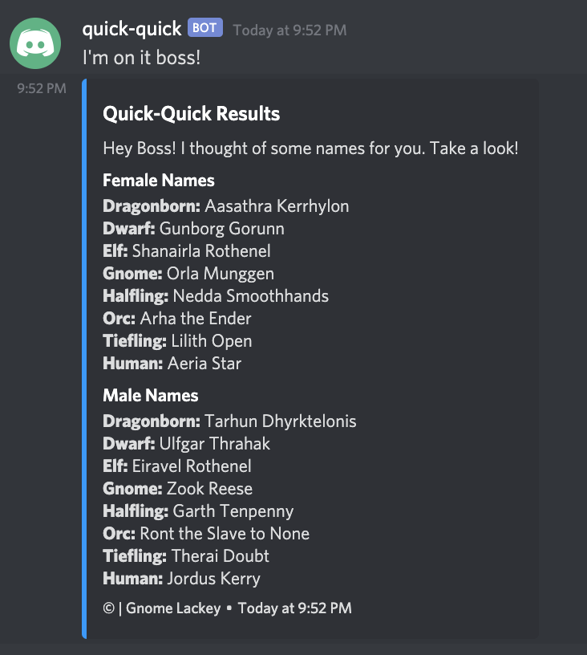
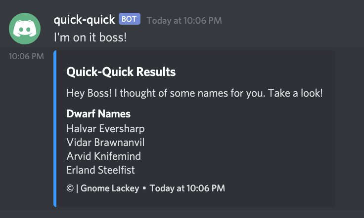
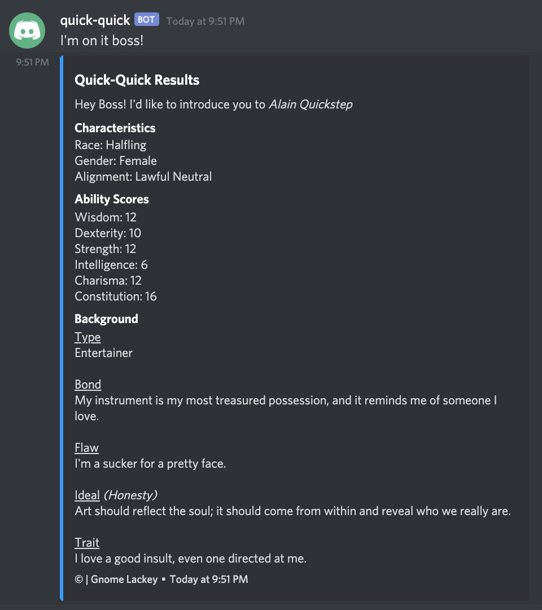
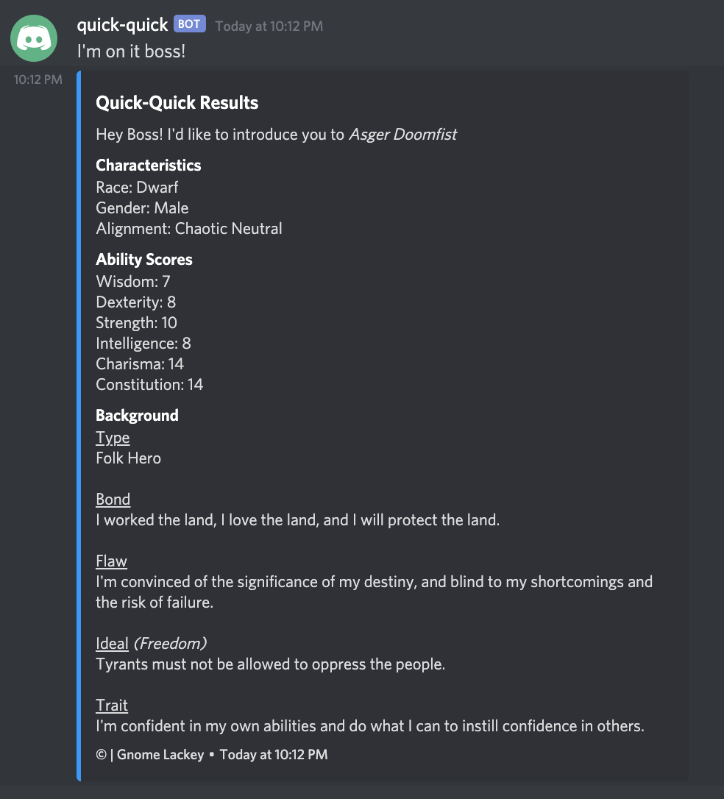
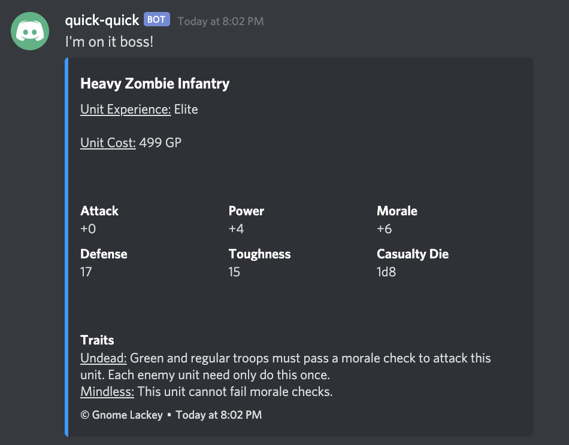
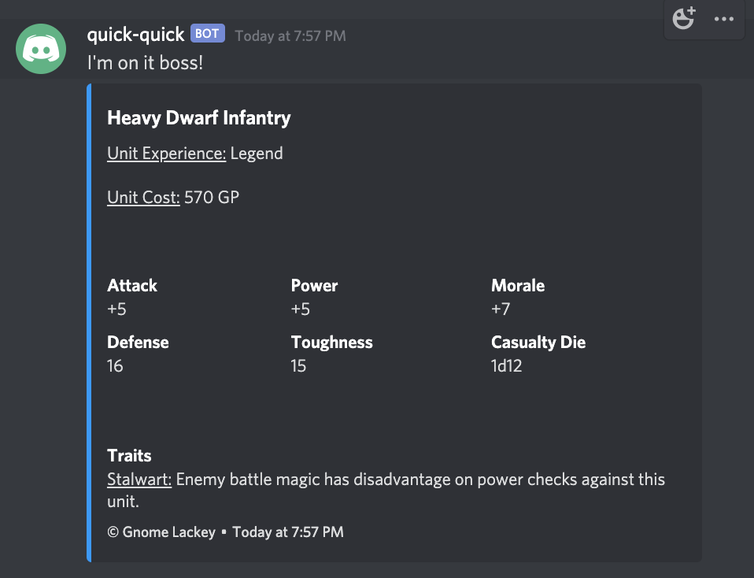

[](https://www.paypal.com/cgi-bin/webscr?cmd=_donations&business=VKWKZKMLU7YVU&currency_code=USD&source=url) Support this lowly gnome by buying him a coffee. Every coin is greatly appreciated!

# quick-quick-bot

The trusted quick-quick gnome lackey is a bot to aid all DM/GMs when they need to think of something on the spot. We've all been there before as DM/GMs. That dreaded moment when a player asks you, "what's this orc's name?" The panic takes hold of you causing you to fumble through loose papers, "her name? Oh yes her name, let me tell you her name. It's, uhhh, Furby the Great." The players laugh, while you facepalm and write down Furby on a note somewhere.

That's where this bot comes in. No longer will you have to worry about name generation! Quick-Quick, your trusty gnome lackey, will do the work for you. Just give him a command, and he'll come up with something on the spot for you to impress your party. Instead of hearing "Peter? His name is Peter? That's so basic." you'll hear "Oh wow Sigard Sundafyllir, that's a baller name, did you just think of that?"

Commands:
[name](#cmd-name)
[npc](#cmd-npc)
[warfare](#cmd-warfare)

How to:
[How to: Install on your server](#ht-server)
[How to: Contribute](#ht-contribute)

<a name="cmd-name"></a>

## Using Quick-Quick to Generate Names

To generate random names with quick-quick all you need to do is type the following in a channel where the bot is included.

```text
!qq name
```

It will respond with a name for each race (humans will default to english), like so:



If you need something more specific, there are a number of arguments that you can supply quick-quick with to narrow down the search, such as:

1. _gender:_ male, or female.
2. _race:_ dragonborn, dwarf, elf, gnome, halfling, human, orc, or tiefling.
3. _language (human only):_ african, celtic, chinese, egyptian, english, french, german, greek, indian, japanese, mesoamerican, norse, polynesian, roman, slavic, or spanish.
4. _count:_ the number of names you want.

To use these arguments just add the value after the command, like so:

```text
!qq name dwarf male 4
```

This will give you something like the following:



<a name="cmd-npc"></a>

## Using Quick-Quick to Generate NPC

To generate a random NPC with quick-quick all you need to do is type the following in a channel where the bot is included.

```text
!qq npc
```

It will respond with a new NPC, like so:



If you need something more specific, there are a number of arguments that you can supply quick-quick with to narrow down the search, such as:

1. _gender:_ male, or female.
2. _race:_ dragonborn, dwarf, elf, gnome, halfling, human, orc, or tiefling.

To use these arguments just add the value after the command, like so:

```text
!qq npc dwarf male
```

This will give you something like the following:



<a name="cmd-warfare"></a>

## Using Quick-Quick to Generate MCDM Warfare Units

If you haven't heard of **Matt Colville's** [_Strongholds & Followers_](https://shop.mcdmproductions.com/products/strongholds-followers-pdf) I highly recommend getting it. It has a lot of great material to add to your campaign. That being said, one of the great things it brings to the table is a mechanic called warfare. This new feature brings war gaming to your 5e campaign by giving _units_ of troops to your player's. These units have stats, abilities, and characteristics that Quick-Quick can generate for you on the fly. In order to hastily order up a unit at random just type the following command.

```text
!qq warfare
```

This will give you something like the following:



If you need something more specific, there are a number of arguments that you can supply Quick-Quick with to narrow down the search, such as:

1. _ancestry:_ bugbear, dragonborn, dwarf, elf, ghoul, gnoll, gnome, goblin, hobgoblin, human, kobold, lizardfolk, ogre, orc, skeleton, treant, troll, or zombie.
2. _experience:_ green, regular, seasoned, veteran, elite, or legend.
3. _equipment:_ light, medium, heavy, super-heavy.
4. _type:_ flying, archers, calvary, infantry.
5. _size:_ tiny, small, medium, large, grand.

To use these arguments just add the value after the command, like so:

```text
!qq warfare dwarf legend heavy grand infantry
```

This will give you something like the following:



<a name="ht-server"></a>

## Getting Quick-Quick Working on your Server

There are a plethora of ways to set the bot up. Some more technical than others. For instance:

- Creating an EC2 instance on AWS and uploading the code there.
- Using a raspberry pie as a server and running the bot there.

There is of course the option of just cloning the code on any computer, and having it run in the background. However, that means the machine would have to stay on for quick-quick to remain in your server's channels.

What ever path you take, you'll first need to fork and clone this repo. We prefer that people fork the repo so that they can make any custom changes to their copy of the code, and keep the main repo clean. If that person wants to then add that code to the main repo they can create a PR with their fork pointing to our branch. See the section below on submitting a PR.

Once you have the code cloned, in the environment you chose, you'll need to install the dependencies. We use _yarn_ as our package manager, so if you don't have yarn you'll need to [install](https://classic.yarnpkg.com/en/docs/install) it. If you hate yarn for some reason you can also use _npm_. Once your package manager is ready, you can install the dependencies by first navigating to the root directory of the project in your favorite terminal, and then running one of the following commands:

### Install Dependencies using yarn

```bash
yarn
```

### Install Dependencies using NPM

```bash
npm i
```

Now that you have all the dependencies (hopefully), you'll then have to create a bot application on discord. _Discord.js_ has an awesome tutorial on how to do this [here](https://discordjs.guide/preparations/setting-up-a-bot-application.html#creating-your-bot). Just follow the instructions there. Then come back here. Don't worry we'll be waiting.

Once you're done creating the application for discord you should have a `client_id`. In order to run the bot locally you'll need to add the `client_id` to your system's environment. To do so, run one of the following commands in your terminal:

### Adding the client_id to MacOS

```bash
export DISCORD_BOT_SECRET=REPLACE_THIS_TEXT_WITH_YOUR_CLIENT_ID
```

### Adding the client_id to Windows

```bash
set DISCORD_BOT_SECRET=REPLACE_THIS_TEXT_WITH_YOUR_CLIENT_ID
```

Once that's done you're ready to run the bot! Simply run one of the following commands from the project's root directory:

### Run using yarn

```bash
yarn start
```

### Run using NPM

```bash
npm start
```

You should see the following in your terminal:

```text
> yarn start
yarn run v1.21.1
$ yarn lint && yarn build && node ./build/bot.js
$ eslint --ext .ts src/
$ tsc -p tsconfig.json
Howdy boss! Quick-Quick gnome lackey at your service.
```

> NOTE: You may see the following WARNING from typescript-estree
>
> =============
>
> WARNING: You are currently running a version of TypeScript which is not officially supported by typescript-estree.
>
> You may find that it works just fine, or you may not.
>
> SUPPORTED TYPESCRIPT VERSIONS: >=3.2.1 <3.6.0
>
> YOUR TYPESCRIPT VERSION: 3.9.6
>
> Please only submit bug reports when using the officially supported version.
>
> =============
>
> This should not cause anything to break within the code. It's just saying that there may be things in our version of TypeScript that
> may not be supported yet by the parser. You can ignore this since we aren't using anything too fancy.

If you navigate over to your discord server you should see _quick-quick_ in your server's channels. Be sure to lock down the permissions of the channels you don't want him to join!

Hopefully, quick-quick does his work well. If he's acting up please make a formal complaint [here](https://github.com/Gnome-Lackey/quick-quick-bot/issues) specifying the commands issued, the responses (or lack there of) received, and the desired outcome you expected.

<a name="ht-contribute"></a>

## Contributing to the Project

If you feel the urge to change something within the project we'd love to see them! We just ask that you abide by the following rules when making code changes:

1) Fork the repo please! We want to keep the core repo clean, and managed by the Gnome Lackey team. That doesn't mean we don't want your code! On the contrary. We just want your branches, and work kept separate from ours until its ready (and approved) to be merged in to ours.
2) Create a PR to the `dev` branch. When submitting a new PR please make sure your fork is pointing to our `dev` branch. This way when it gets approved and merged our team can go in, run tests, and manually check that everything is still functioning correctly.
3) Please describe what your PR is doing. Although we require our review, we also don't have _all_ the time in the world to look through the code line-by-line. Please make sure to specify the following when submitting a PR: What the change does, Why you think the change should be included, and any important notes we should know about.

That's it! Thanks for any help or contribution to the project 😀
